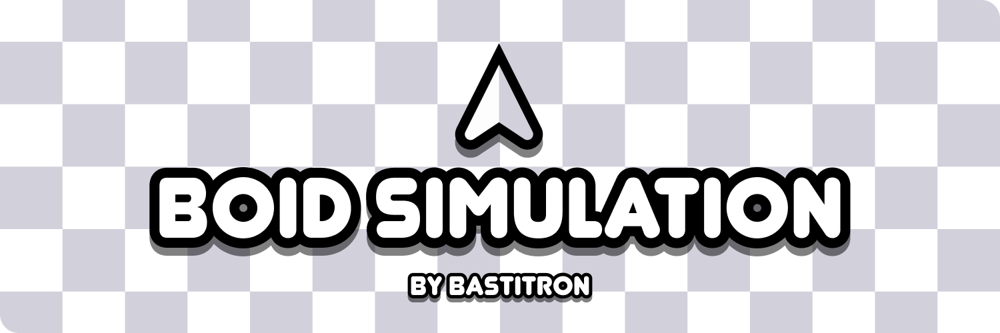

A simple Boid Simulation application that replicates the movement patterns observed in flocking birds.

## Features

- Gui for controlling rules and so on
- [Maybe] Colission boxes
- [Maybe] Predator boids

## Build instructions

A Win64 build is provided under releases.

```bash
  ./vcpkg install imgui[sdl2-renderer-binding]
  ./vcpkg install sdl2
  ./vcpkg install fmt
  ./ vcpkg install sdl2-image
```

### Dependencies

**VCPKG**
- [SDL2](https://vcpkg.link/ports/sdl2)
- [ImGUI](https://vcpkg.link/ports/imgui)
- [fmt](https://vcpkg.io/en/package/fmt)
- [SDL2_Image](https://vcpkg.io/en/package/sdl2-image)


